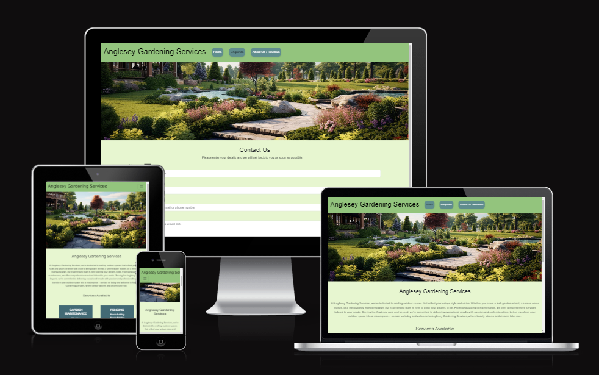

---

# *Anglesey Gardening Services*

The site can be accessed by this [link](https://therealmccall.github.io/anglesey-gardening-services/)

---
## Contents

* [Project Overview](#project-overview)
* [User Stories](#user-stories)
* [Features](#features)
* [Technologies Used](#technologies-used)
* [Wireframes](#wireframes)
* [Deployment](#deployment)
* [Testing](#testing)
* [Credits](#credits)
* [Acknowledgements](#credits)
---

## Project Overview

Anglesey Gardening Services website has information for visitors about the company.  It also shows information about what services it provides and allows the visitors to quickly contact the company.

## User Stories

### First Time Visitor Goals:

* Understanding the Site's Purpose: As a first-time visitor, I want to quickly grasp the main purpose of the site and learn more about the gardening services offered
* Easy Navigation: As a first-time visitor, I want to easily navigate the site to find relevant content about different gardening services.
* Seeking reviews and Social Proof: As a first-time visitor, I want to be able to read previous customer reviews to understand customer experiences and check their social media presence to gauge their trustworthiness and popularity.

### Returning Visitor Goals:

* Finding Service Details: As a returning visitor, I want to locate detailed information about specific gardening services.
* Contact Information: As a returning visitor, I want to find the best way to contact the service provider with any questions.
* Social Media Links: As a returning visitor, I want to find links to the service provider's social media.

### Frequent Visitor Goals:
* New Services and Offers: As a frequent user, I want to be able to check for newly added services or special offers.
* Contact Information: As a frequent user, I want to an easy way to get back in contact with the provider.

## Features

+ ### Navbar

+ ##### Navigation
    - Positioned at the top of the page and fixed to scroll with the user.
    - Contains company brand on the left side that is clickable to bring you page to the home page.
    - Contains navigation links:
    
        * Home - links to the home page.
        * About - links to the about us page.
        * Contact Us - links to the contact us page. 
    
    - The link text changes black when hovered over.
    - The link button lifts and gets darker when hovered over.
    - The text of the currently active page is black.
    - the navigation bar is responsive and has a hamburger menu on tablets and mobile devices.

    Navigation for desktop as below image

    

    Navigation for tablet as below image

    

    Navigation for mobile as below image

    

    Hamburger menu for tablet and mobile as below image

    

---

+ ### Home Page

    - Represents:

        * The name of the company
        * Information about the company
        * Services available
        * Social media links
        * The page is responsive on common screen sizes.

#### Header Section

- Includes:

    * The name of the company.
    * Options to visit the enquiries and reviews section of the site.
    * Has a clear picture of a landscaped garden supporting what the site is for.

#### Introduction Section

- Includes:
        
    * An introduction to the company.
    * What services are available to the visitor.

#### Footer Section

- Includes:

    * Social media links change colour on mouse over.
    * Social media links have a spin animation on mouse over.

--- 
+ ### About Us Page

    - Includes:

        * An identical Header Section as the main page for consistency.
        * An About Us Section explaining the background of the company and what they can do.
        * Customer Reviews Section giving the visitor an idea of customer satisfaction.
        * An Identical Footer Section as the main page for consistency.
        * The page is responsive on common screen sizes.

---
+ ### Contact Us Page

    - The contact page has a form:
        
        * An identical Header Section as the main page for consistency.
        * All form input fields are required to be filled in.
        * There is placeholder text on each input field.
        * The Submit button changes colour when the mouse is hovered over.
        * Once complete and submitted the form takes you to the form completed page.
        * An Identical Footer Section as the main page for consistency.
        * The page is responsive on common screen sizes.

---
+ ### Form Completed Page

    - includes:
        
        * An altered Header Section removing the landscape photo and instead placing it in the body.
        * A clear message with a transparent background stating that the form has been submitted.
        * A clear message that the company will get back to the visitor.
        * An Identical Footer Section as the main page for consistency.
        * The page is responsive on common screen sizes.

---

## Technologies Used

- Technologies used to create the site include:
    * [HTML](https://developer.mozilla.org/en-US/docs/Web/HTML) - was used to create the website.
    * [CSS](https://developer.mozilla.org/en-US/docs/Web/css) - was used for the styling of the website.
    * [Bootstrap](https://getbootstrap.com/) - Framework used.
    * [Gitpod](https://gitpod.io/) - was the cloud based IDE used for creating and editing of the code.
    * [VSCode](https://code.visualstudio.com/) - IDE Used.
    * [Git](https://www.git-scm.com/) - was used for website version control.
    * [GitHub](https://github.com/) - was used for hosting of the code of the website.
    * [GitHub Pages](https://pages.github.com/) - was used for hosting the deployed front-end site.
    * [Gimp](https://www.gimp.org/) - Software used to resize images for README.md.

## Design

### Color Scheme

- Light green was used for the navigation bar background as it is associated with nature, making it an ideal choice for a gardening website.

- A very light green was used as the main background colour of the website as it provides a clean and subtle look that doesn't distract from the content while maintaining a natural feel. It also complements the overall gardening theme and goes well with the other green elements.

- A darker, blue-green background was used for the service cards to help them stand out against the lighter background without being too jarring.

- A lighter blue-green was used for the navigation buttons as it is visible against the navigation bar and works well with the other colours of the website. while being different enough to be noticeable.

### Typography

- Arial was used as the main font for the website as it is clear to read and has a professional look.
-  [Font Awesome](https://fontawesome.com) was used for the social icons used in the page footer.

### Wireframes

#### Mobile devices

- [Home Page. Mobile Screen](documentation/home-page-mobile.png)
- [About Us Page. Mobile Screen](documentation/about-us-mobile.png)
- [Contact Us Page. Mobile Screen](documentation/contact-us-mobile.png)
- [Form Submitted Page. Mobile Screen](documentation/form-complete-mobile.png)

#### Tablets

- [Home Page. Tablet Screen](documentation/home-page-tablet.png)
- [About Us Page. Tablet Screen](documentation/about-us-tablet.png)
- [Contact Us Page. Tablet Screen](documentation/contact-us-tablet.png)
- [Form Submitted Page. Tablet Screen](documentation/form-complete-tablet.png)

#### Desktop

- [Home Page. Desktop Screen](documentation/home-page-desktop.png)
- [About Us Page. Desktop Screen](documentation/about-us-desktop.png)
- [Contact Us Page. Desktop Screen](documentation/contact-us-desktop.png)
- [Form Submitted Page. Desktop Screen](documentation/form-complete-desktop.png)

---

## Deployment

### Deployment to Github Pages

- The site was deployed to GitHub pages. The steps to deploy are as follows: 
  - In the [GitHub repository](https://github.com/TheRealMcCall/anglesey-gardening-services), navigate to the Settings tab 
  - From the source section drop-down menu, select the **Main** Branch then click "Save".
  - Once the branch has been selected, the page will be automatically refreshed with a detailed ribbon display to indicate the successful deployment.

The live link can be found [here](https://therealmccall.github.io/anglesey-gardening-services/)

### Local Deployment

In order to make a local copy of this project, you can clone it.
In your IDE Terminal, type the following command to clone my repository:

- `git clone https://github.com/TheRealMcCall/anglesey-gardening-services.git`

---

## Testing

Please refer to [TESTING.md](TESTING.md) file for all documentation related to testing.

## Credits

### Content

- Code taken from code intitute LMS to trigger response page. https://formdump.codeinstitute.net  (this was later changed to navigate to a custom form submitted page).
- Inspiration from stack overflow on how to get font awesome icons to animate on hover over. [here](https://stackoverflow.com/questions/21030259/fontawesome-icons-spin-only-on-mouseover).
- Inspiration for code used to create a transparent box around form submitted box. [here](https://developer.mozilla.org/en-US/docs/Learn/CSS/Howto/Make_box_transparent).
- Code from Mozilla.org used to add a ‘lift’ effect on my nav buttons. [here](https://developer.mozilla.org/en-US/docs/Web/CSS/transform-function/translateY).

### Media

- Hero Image this was sourced from [Vecteezy](https://Vecteezy.com) and can be found [here](https://www.vecteezy.com/photo/30660484-professional-landscape-designs-high-quality).

### Tools
- [mycolor.space](https://mycolor.space/) was used to create the colour pallete.

## Acknowledgements
- [Iuliia Konovalova](https://github.com/IuliiaKonovalova) - My Code Insitute Mentor for all her help, support and advice.
- [Lewis Dillon](https://github.com/LewisMDillon) - Code Insitute Cohort Facilitator weekly stand-ups and motivational support.

---

* [Back To Top](#anglesey-gardening-services)