# Testing
---
# Contents

* [Browser Compatibility](#browser-compatibility)
* [Responsiveness](#responsiveness)
* [Manual Testing](#manual-testing)
* [Validator Testing](#validator-testing)
* [LightHouse Report](#lighthouse-report)
* [Bugs](#bugs)
* [Unsolved Bugs](#unsolved-bugs)
---

## Browser Compatibility

I've tested my deployed project on multiple browsers to check for compatibility issues.

| Browser | Screenshot | Notes |
| --- | --- | --- |
| Chrome | 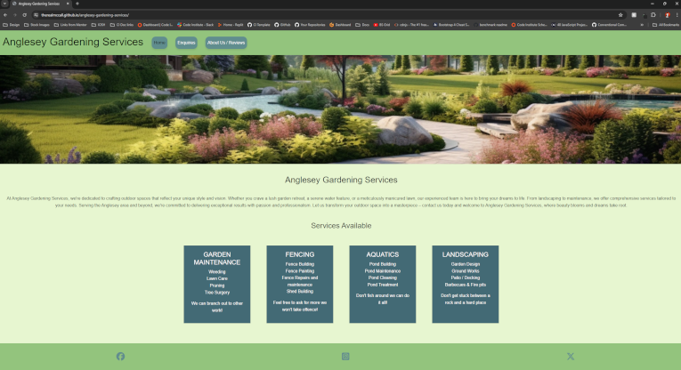 | Works as expected |
| Firefox | 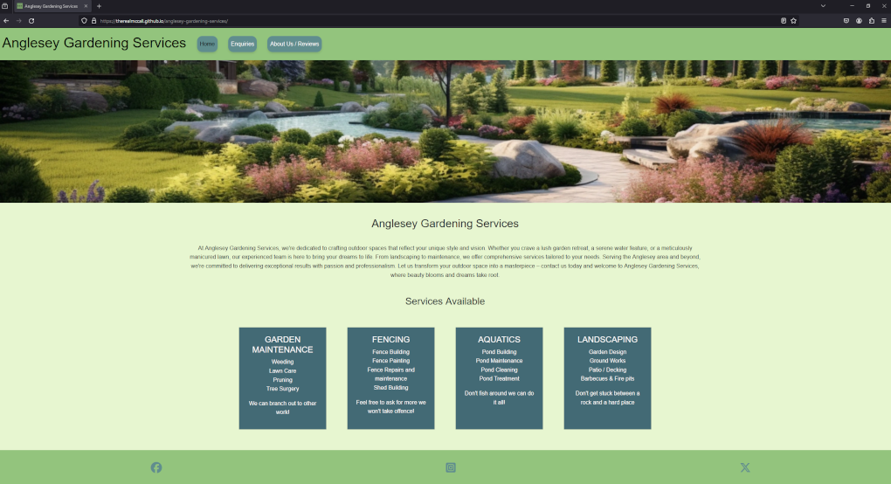 | works as expected |
| Edge | 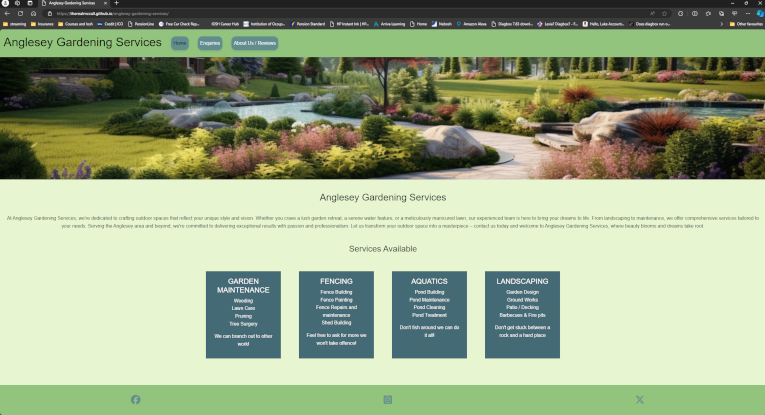 | Works as expected

## Responsiveness

The website was tested on the following browsers for responsiness with no problems found.
  - Chrome
  - Firefox
  - Edge

The website was also tested on numerous sized screens and responded to all sizes:-
  - Google Pixel 8 Pro 
  - Samsung Galaxy S22 PLUS 
  - iPhone 15
  - 15" 1080p laptop screen 
  - 24" 1080p desktop screen 
  - 27" 1440p desktop screen

The website was checked on various personal devices and [responsiveviewer.org](https://responsiveviewer.org/) was used to check others.

| Device | Screenshot | Notes |
| --- | --- | --- |
| 1440p Desktop Monitor |  | Works as expected |
| 1080p Desktop Monitor | 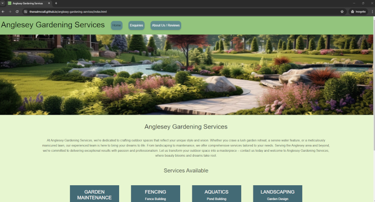 | Works as expected |
| 1080p Portrait Desktop Monitor | 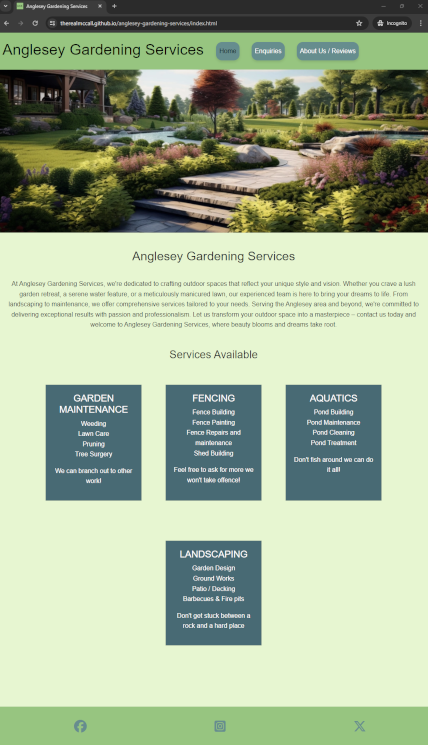 | Works as expected |
| Google Pixel 8 Pro |  | Works as expected |
| Galaxy Tab S7 |  | Works as expected |
| iPhone 15 | 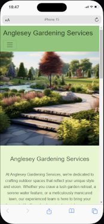 | Works as expected |

Chrome development tools were also used throughout the design process to check responsiveness and breakpoints. Adjustments were made accordingly.

## Manual Testing

Manual testing was carried out on all pages to ensure consistency.

| Feature | Action | Expected Result | Working |
| --- | --- | --- | --- |
|HEADER (ALL PAGES)|
|Brand Name	  | Click  | Links to Home Page | Yes |
|Home Button  | Hover over Home  | Button lifts and background darkens | Yes |
|Enquiries Button  | Hover over Enquiries  | Button lifts and background darkens| Yes |
|About Us / Reviews Button  | Hover over About Us / Reviews  | Button lifts and background darkens| Yes |
|Home Button  | Click on Home  | Links to Home Page| Yes |
|Enquiries Button  | Click on Enquiries  | Opens Contact Us page | Yes |
|About Us / Reviews Button  | Click on About Us / Reviews  | Opens About Us page | Yes |
|Hamburger Button (Tablet/Mobile) | Click on Hamburger Menu | Opens drop down menu with navigational links | Yes |
|Home Button on drop down menu| Click on Home in dropdown  | Opens Home page | Yes |
|Enquiries Button on drop down menu| Click on Enquiries in dropdown  | Opens About Us page | Yes |
|About Us Button on drop down menu| Click on About Us / Reviews in dropdown  | Opens About Us page | Yes |
|  |  | |
| FOOTER (ALL PAGES) | | |
| Social Media Section	| Hover over Facebook icon |Icon darkens and spins | Yes |
| Social Media Section	| Hover over Instagram icon |Icon darkens and spins | Yes |
| Social Media Section	| Hover over X icon  |Icon darkens and spins | Yes |
| Social Media Section	| Click on Facebook icon |Opens Facebook in a new tab | Yes |
| Social Media Section	| Click on Instagram icon |Opens Instagram in a new tab | Yes |
| Social Media Section	| Click on X icon |Opens X (Twitter) in a new tab | Yes |
|  |  | |
| CONTACT US (PAGE SPECIFIC) |  |
| Form  | Placeholder text	|Placeholder text is displaying | Yes |
| Form  | Click on input field	|Border of field is highlighted | Yes |
| Form  | Click on Submit (when fields incomplete or empty) |Error message to fill in field | Yes |
| Form  | Click on Submit (when email field invalid) |Error message to enter correct email address | Yes |
| Form  | Click on Submit (when fields completed correctly) |Navigates to form completed page | Yes |
| Form  | Hover over Submit |background colour changes | Yes |

## Validator Testing
+ ### HTML
  #### Home Page
    - No errors or warnings were found when passing through the official W3C validator.

    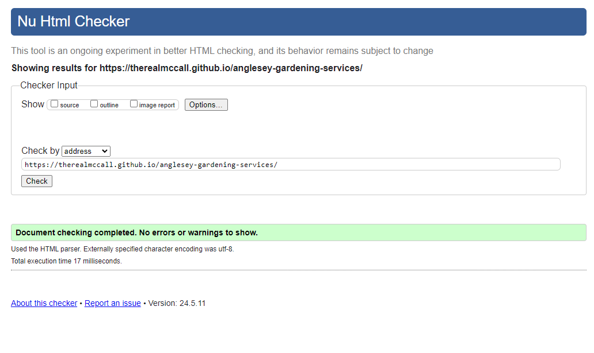
    
  #### About Us Page
    - No errors or warnings were found when passing through the official W3C validator.

    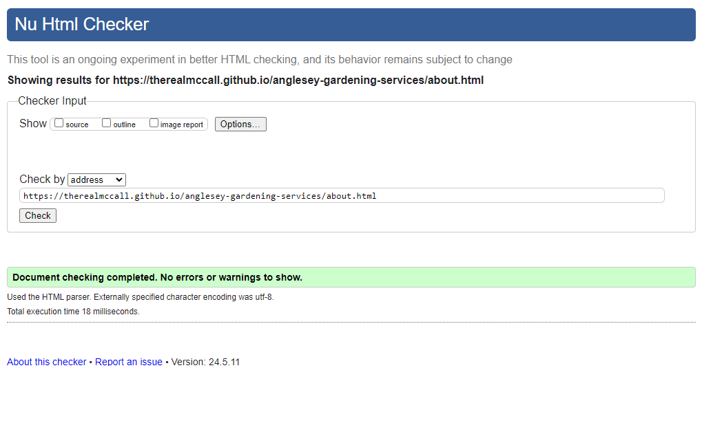

  #### Contact Us Page
    - No errors or warnings were found when passing through the official W3C validator.

    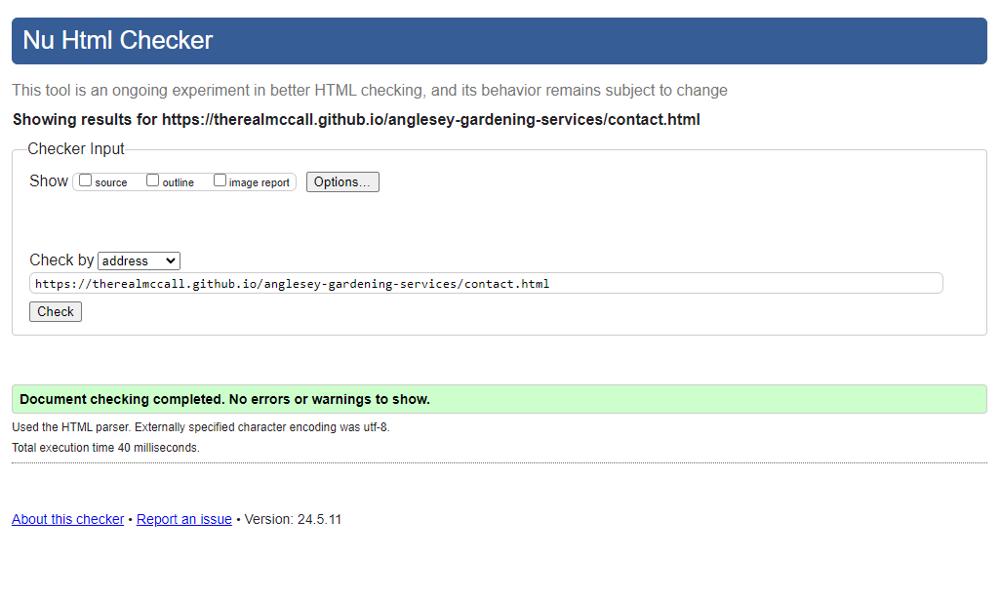

  #### Form Completed Page
    - No errors or warnings were found when passing through the official W3C validator.

    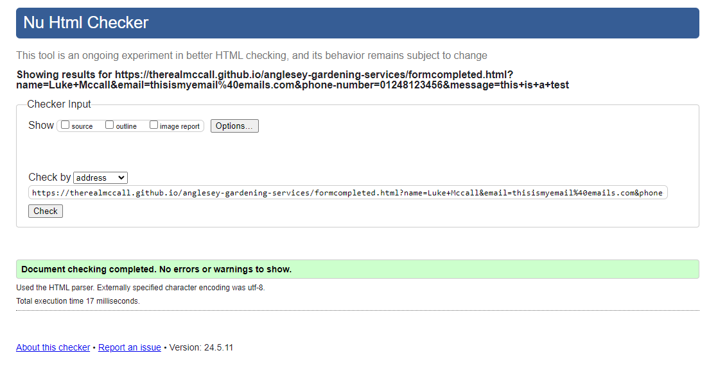

---

+ ## LightHouse report

    - Using lighthouse in devtools I confirmed that the website is performing well, accessible and colors and fonts chosen are readable.
    
  ### Home page

  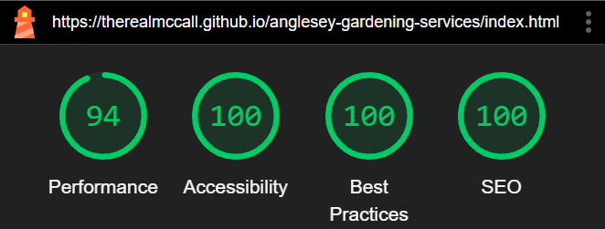

  ### About Us page

  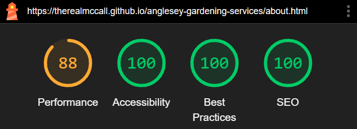

  ### Contact Us page

  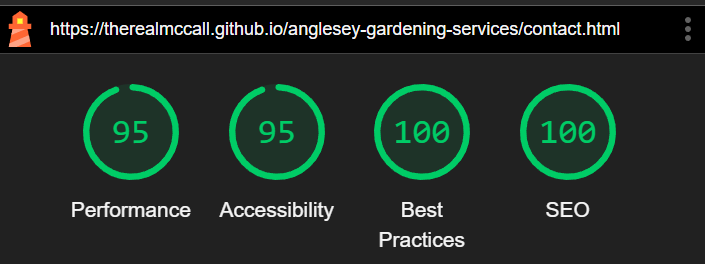

  ### Form Completed page

  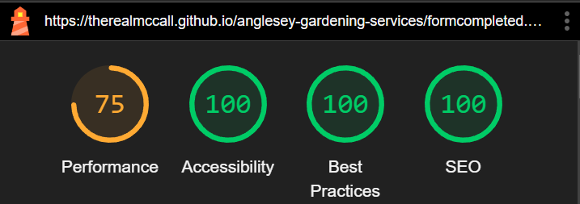

---
## Bugs
+ ### Solved Bugs

    * Hero Image causing overflow on some smaller screen sizes.
    
      *Solution:* Added max width 100% to style.css
    
    
    
    * Footer not at end of webpage in some screen sizes.

      *Solution:* Added height 100% to style.css

     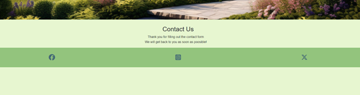

    * Submit button too close to footer on Contact Us page.

      *Solution:* Added margin-bottom to .contact form.

    

    * Customer reviews aligned left and not center on mobile screens.

      *Solution:* Bootstrap class Justify-content-center added.

    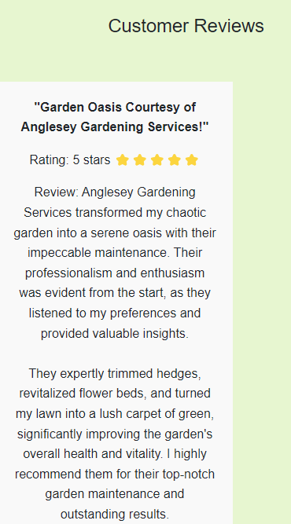

    * Performance issues with oversized hero image.

      *Solution:* Created 3 different image and used seperately for different viewports to limit images becoming pixelised.

    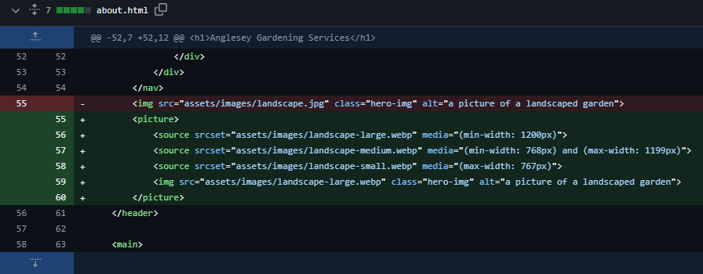

+ ### Unsolved bugs.
  - None Found.
---

* [Back To Top](#testing)